<div align="center">

# NIGHTFALL PROTOCOL

**A custom GitHub telemetry card built for [@duartess7](https://github.com/duartess7).**



</div>

## Overview

Nightfall Protocol transforms public GitHub activity into a single original SVG dashboard. It was designed from scratch to match the dark, gothic visual identity of the `duartess7` profile without depending on generic statistics-card services.

The panel tracks:

- yearly contributions and the latest 28-day pulse;
- public repositories, stars, forks and followers;
- current and longest contribution streaks;
- a 52-week contribution signal;
- recent public GitHub transmissions and active days.

## How it works

The generator uses Python's standard library to read public data from the GitHub REST and GraphQL APIs, then writes the complete dashboard as an SVG. A GitHub Actions workflow regenerates the asset every night and whenever the generator changes.

```text
GitHub API → Python generator → metrics/nightfall.svg → profile README
```

## Embed

```html

```

## Authorship and usage

Nightfall Protocol was created for and is owned by **duartess7**. The repository is public for presentation and verification of authorship; it is not offered as an open-source project.

Copyright © 2026 duartess7. All rights reserved. See [LICENSE.md](./LICENSE.md).
